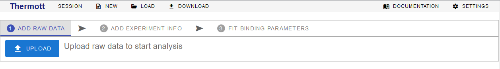
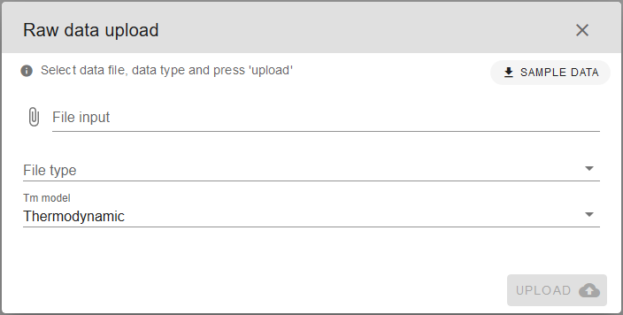
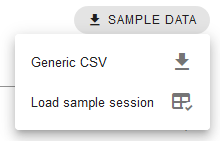
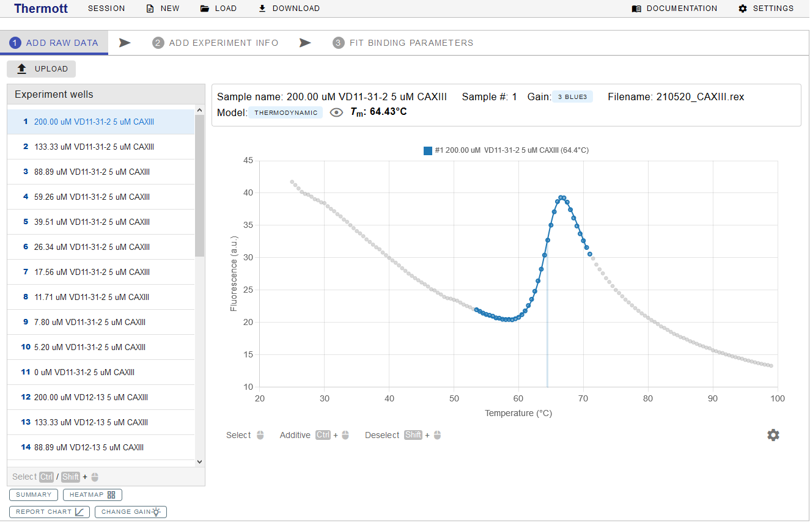
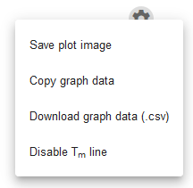
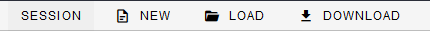
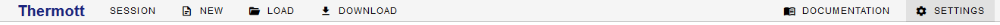
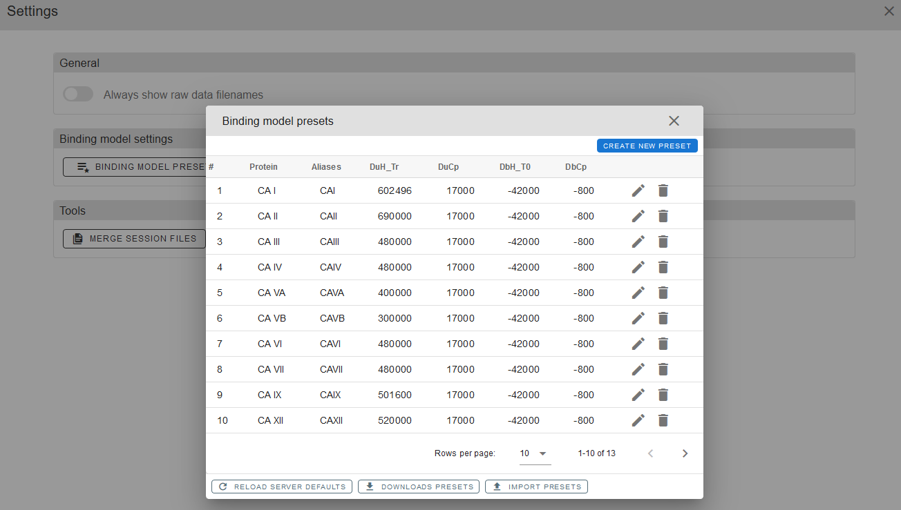

# RAW DATA

---
## Uploading experiment data

To upload your experiment data, use the `UPLOAD` button located at the first data analysis tab `ADD RAW DATA`.

You will be prompted with the `Raw data upload` window. Click on `File input` field to select your data file. Next, choose the corresponding `File type` from the drop-down menu. Choose from .csv (generic or as transposed excel data sheet) or .rex (produced by RotorGene thermocycler software) formats. [Supported raw data formats](#supported-raw-data-formats) are described in more detail in the [Addendum](#addendum).

!!! Note "SAMPLE DATA"
    
	
	
	If you just want to test out the tool and see how it works, you can use premade `SAMPLE DATA`. Just download “Generic CSV” and use it as the `File input` source. “Load sample session” option will replace current session with a sample finished data analysis session.
	

`Thermodynamic` melting curve model is recommended (default) but `Derivative` model is also available and can be selected from the `Tm model` drop-down menu. Further information about melting curve models can be found at [Melting curve models](#thermodynamic) in the [Addendum](#addendum).
Finally, click `UPLOAD`.

Consequently, data will be uploaded, parsed and melting curves fitted to the experiment data. Successful upload prompt will appear briefly and processed data with protein melting curves should appear on the screen.

---
## Protein melting temperatures

Once experimental data are successfully uploaded, protein melting curves will be displayed. Under `Experiment wells` panel, there will be a list of samples from the experiment. If one is selected, a detailed chart with experimental data is displayed as in the example below. Raw data points are displayed as grey dots, colored dots mark the data points used for protein melting temperature (<i>T</i>m) determination while the colored line represents data fit for the selected sample. Moreover, a straight grey'ish vertical line is drawn at the <i>T</i>m value (this can be disabled by pressing a cog icon below the plot chart and selecting the “Disable <i>T</i>m line” option). 

Above the chart, the sample name, number, data filename, data fitting model, and calculated <i>T</i>m are displayed. By clicking on the eye icon, you can see some additional information.

!!! Note "Selecting multiple samples"
    Multiple samples can be selected at the same time using `CTRL` and `SHIFT` on the keyboard.

!!! Note "<i>T</i>m - protein melting temperature"
    Temperature at which both, the folded and unfolded states are equally populated at equilibrium. 
	

#### Adjusting <i>T</i>m 

Depending on the experimental data, some adjustments to the initial determination of <i>T</i>m might be required. Common examples of such cases are artefacts that have to be eliminated to avoid incorrect protein melting region determination by the algorithm. The data points from the sample used for <i>T</i>m determination, can be added or removed using the left mouse button to select the region while pressing the `CTRL` and `SHIFT` keyboard keys. 

It is advisable to check all samples whether there are no clear data point outliers and the <i>T</i>m is determined correctly before proceeding to add the [EXPERIMENT INFO](02experimentinfo.md#experiment-info).

!!! Note "Protein stability assays"
	If you are running an assay to determine best protein storage conditions you can start testing various additives for this purpose. For comparing protein stability, usually Δ<i>T</i>m is sufficient.

---	
### Saving, exporting or generating a protein melting temperature report

At the bottom of the `Experiment wells` panel you can click `SUMMARY`, `HEATMAP`, `REPORT CHART` or `CHANGE GAIN` buttons.

`SUMMARY` opens the “Summary” of the <i>T</i>m values from the samples and allows to EXPORT the summary as a CSV table or copy it to the clipboard.

`HEATMAP` displays “Summary heatmap” – a graphical representation of the <i>T</i>m value distribution across the samples, which helps to quickly identify potential “hits” or other outliers. Reference temperature can be changed by clicking on "wells" or adjusted manually in the reference temperature field at the top.  You can save it as a SVG or PNG file by clicking on `SAVE IMAGE`.

`REPORT CHART` button generates a “Report chart” for the selected sample(s). You can `SAVE IMAGE` of it as an SVG or PNG file, some additional options are available.

`CHANGE GAIN` opens a menu with additional experiment sensitivity/gains options, if available.

Data from the sample experiment plot can also be exported. Click on the cog icon below the chart and select to save the plot as an image, save graph data in CSV file or copy the graph data to the clipboard. Save plot image will save the plot image as a PNG file. `Copy graph data` will copy the data from the plot to the clipboard to be pasted into the spreadsheet. It is useful if you want to use your own software for visualization.

---
## Addendum

### Supported raw data formats

#### Generic CSV (.csv)

It is a generic format that is meant to be used when the native format of your TSA/DSF device is not supported. Users have to convert their data to this format themselves.

Format example:

| Temperature |  Exp. 1 | Exp. 2 | Exp. 3 | Exp. 4 | ... |
|-------------|---------|--------|--------|--------|-----|
| 25          | 16.55   | 19.81  | 21.82  | 20.85  | ... |
| 25.5        | 16.39   | 19.72  | 21.68  | 20.72  | ... |
| 26          | 16.49   | 19.62  | 21.61  | 20.65  | ... |
| 26.5        | 16.39   | 19.46  | 21.48  | 20.61  | ... |
| 27          | 16.36   | 19.52  | 21.44  | 20.56  | ... |
| ...         | ...     | ...    | ...    | ...    | ... |

First column has to be labelled "**Temperature**" and has to contain increasing temperatures in Celsius units.
The other columns should contain the signal, usually fluorescence, values. Column header can be a string (e.g., sample name, conditions) or just a number.

#### RotorGeneQ Excel data sheet (transposed) (.csv)

Export format obtained when performing experiments with *Corbett Rotor-Gene Real Time PCR Machine*

#### RotorGene experiment (.rex)

Native format obtained when performing experiments with *Corbett Rotor-Gene Real Time PCR Machine*

#### Agilent MxPro (.txt)

Export format obtained when performing experiments with *Agilent MxPro* devices.

#### Applied Biosystems SDS (.txt)

Export format obtained from *Applied Biosystems SDS* devices.

#### BioRad CFX (.txt)

Export format obtained from *BioRad CFX* devices.

### Melting curve models (<i>T</i>m model) 

<em>Thermott</em> supports several melting curve models to fit your data. Melting curve models are used to determine the melting temperature (<i>T</i>m). 

####Thermodynamic

Model has been described by [Pantoliano (2001)](https://doi.org/10.1177/108705710100600609) and [Matulis (2005)](https://doi.org/10.1021/bi048135v).

$$
y(T) = y_f+y_{fs} (T-T_m) + \frac{y_u -y_f+ (y_{us} -y_{fs}) (T-T_m)}{1+e^{\Delta_U H\left(1 - \frac{T}{T_m}\right) +\Delta_U C_p\left( T- T_m  - T \ln\left(\frac{T}{T_m}  \right)\right)/RT}}
$$

#### Derivative

In the derivative model, the melting temperature is simply estimated from the maximum of the first-order derivative of the fluorescence data. The derivative for numeric data can be calculated by the equation:

$$
y'(\frac{T_{n+1}+T_n}{2}) \approx \frac{y_{n+1}}{y_{n}}
$$

<em>Thermott</em> additionally uses signal filtering and subsequent cubic interpolation to achieve a more accurate melting temperature. 

### Saving the session for later use

You can save your progress during any stage of the data fitting session. At the top right side there is a session saving panel, from which you can start a `NEW` session, `LOAD` previously saved session or save current session by clicking `DOWNLOAD`. Some additional information about the file can be saved by clicking on `SESSION`. 

Several session files can be merged into one file by using `MERGE SESSION FILES` tool, under `SETTINGS` at the right top corner.

### Custom binding model presets

You can save your protein’s custom binding presets for future usage. This can be done via `BINDING MODEL PRESETS` in `SETTINGS` by simply clicking `CREATE NEW PRESET` and filling in your parameters. For more details on parameters please refer to the article [CITATION](06citation.md#citation). 

`DEFAULT BINDING MODEL TEMPERATURE` can also be adjusted in the `SETTINGS` panel.

[NEXT CHAPTER :octicons-triangle-right-24:](02experimentinfo.md){ .md-button .md-button--primary }

