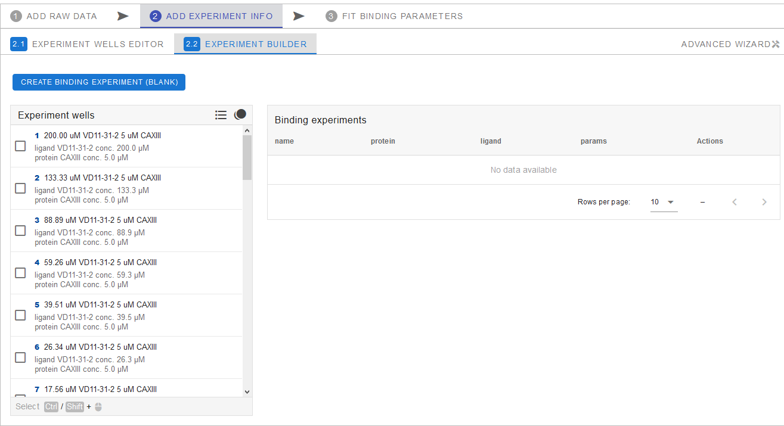

# EXPERIMENT INFO

Besides the uploaded raw data, additional information on the sample is required for the data processing. Supply it in the second step. 

In the `ADD EXPERIMENT INFO` tab there are two subtabs – `EXPERIMENT WELLS EDITOR` and `EXPERIMENT BUILDER`.

---
## EXPERIMENT WELLS EDITOR

Here you can provide the information on the contents of the wells in your experiment. Only ligand concentration (`ligand conc.`) is required for the ligand binding analysis. However, you can fill in the sample `name` for easier sample identification and supply `protein` and `ligand` names or other identifiers for convenience. Protein concentration can also be filled-in later, for the whole data set at once. The table spreadsheet supports the copy-paste information from other spreadsheets (Microsoft Excel, Libre office Calc and others). A value can be copied to all the cells in the column by right-clicking its header.

Tm data is automatically directly imported from the `ADD RAW DATA` tab. It can also be manually filled, overriding imported values, after enabling this by clicking `Allow editing Tm` switch.

Data from `EXPERIMENT WELLS EDITOR` can be exported by clicking `EXPORT TABLE` button.

---
## EXPERIMENT BUILDER

In order to conduct the ligand binding analysis, you have to assign samples from the `Experiment wells` list to an experiment using the `Experiment builder`. The data points corresponding to the samples assigned to the same experiment will be plotted and calculated together to yield the binding constant. Therefore, a single experiment must contain samples of the same protein concentration with several different ligand concentrations, including zero.

!!! Note "Detailed list"
    Experiment wells list can be displayed as a compact list with just a name of the sample or as a detailed list, which includes all the additional information (filled out in the previous step) on the protein and ligand. You can toggle between these two display options by clicking the list icon next to `Experiment wells`.
	

### Creating the binding experiment

Select samples/wells that correspond to datapoints you want to process collectively by clicking the corresponding checkboxes next to the sample number in the list. Selection must include experiments with several ligand concentrations and at least one experiment with no ligand (concentration equal to zero), all with identical protein concentration. Next, click `CREATE BINDING EXPERIMENT (FROM SELECTED)` above the `Experiments wells` list.

In the pop-up window, fill-in the details about the experiment. Name the experiment, ligand, protein, and specify the protein concentration in the experiment (all samples should be of the same protein concentration). Provide the other protein related parameters manually or select a preset from the `Parameters presets list`. 

!!! Note "Unfolding and Binding parameters"
    If you do not have unfolding and binding parameters for the given protein/ligand system or have incomplete set, you can try `Predict unfolding parameters` by filling in protein residue count and pressing `APPLY` . For `Binding parameters` you can try using `Typical binding parameters` by clicking `APPLY` in corresponding frame. This should give you close enough approximate of the missing parameters for further data analysis in case those parameters can't be obtained experimentaly or otherwise. 
	Further details can be found [here](05troubleshooting.md#unfolding-and-binding-parameters).
	

Once all the fields are filled, click `ADD+` to create the experiment. A binding experiment with the defined name will be created:

By clicking the corresponding arrow on the left you can expand it to see the list of samples/wells within the experiment. Additional samples/wells can be added by drag-dropping them from the `Experiment wells` list. The existing samples can be rearranged or deleted using the trashbin icon on the left of each sample.

Information related to the experiment can be edited by pressing the pencil icon on the right side:

In the opened window, various parameters can be readjusted or corrected. Click `APPLY` to save the changes.

!!! Note "Experiment well copies"
    If you need to use the same samples/wells from the list in multiple binding experiments, you can enable or disable copies by toggling between `Show copies` and `Disallow copies` next to the `Experiment wells`.
	

Once the experiments are created, we are ready for the final protein-ligand binding determination stage in the next tab: [FIT BINDING](03fitbinding.md#fit-binding).

[NEXT CHAPTER :octicons-triangle-right-24:](03fitbinding.md){ .md-button .md-button--primary }

