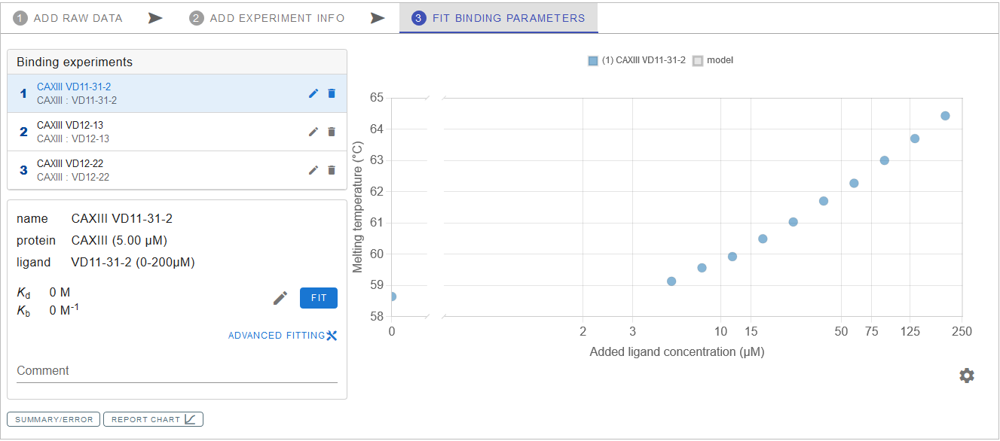
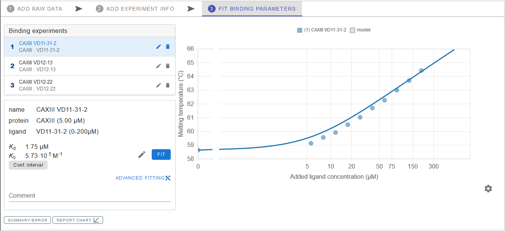
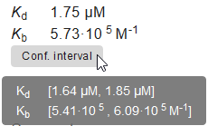
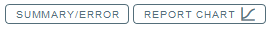
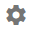
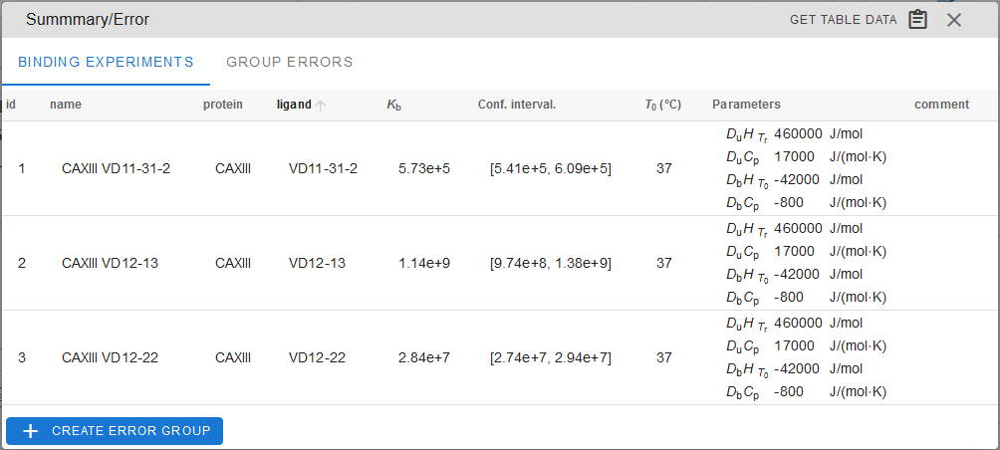
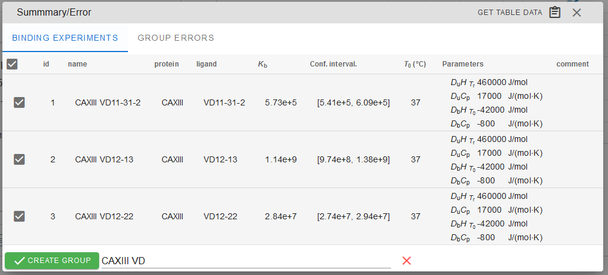
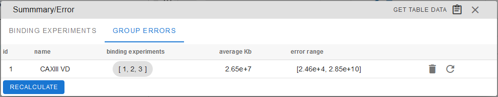
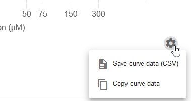
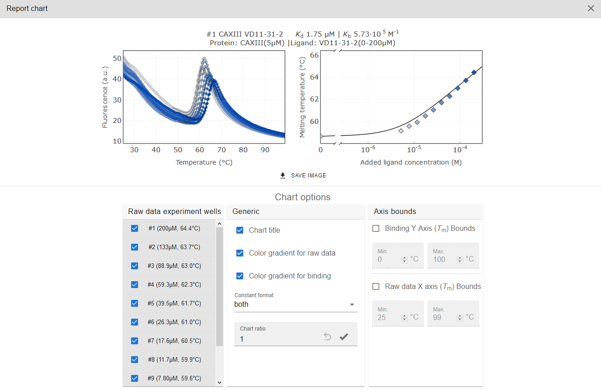

# FIT BINDING

## Fitting data

On the left side under the `Binding experiments` you can find the list of your experiments that were created in the previous step. Clicking on the experiment from the list causes all the data points from the experiment to appear as a graph on the right panel. If everything was filled-out correctly, pressing `FIT` button will yield a plot of a fitting <i>K</i>b/<i>K</i>d model across the experiment data points and calculated <i>K</i>b and <i>K</i>d values, displayed below the experiment list. 

If you want to visually evaluate how data fit would look for a different <i>K</i>b value, the latter can be adjusted manually by pressing the pencil icon.

For more fitting options you can click on `ADVANCED FITTING` and manually adjust fitting parameters.

#### Error values

Error values (more specifically, data confidence intervals) for the experiment are calculated automatically and can be accessed by pressing `Conf. interval`, which is located below the <i>K</i>b/<i>K</i>d values.

!!! Note "Comments"
    You can leave notes to yourself in the Comment field just below <i>K</i>b/<i>K</i>d.

	
#### Saving and exporting the Binding data

Saving the binding data, exporting or preparing a report is achieved via the toolbox below the `Binding experiments` list and cog icon below the chart:

	

	
	
`SUMMARY/ERROR` allows to see the summary of the binding experiments, copy information from the experiment table or `GET TABLE DATA` (to save it as a CVS file or copy it to the clipboard).	

You can create groups of experiments for average value calculations by clicking `+ CREATE ERROR GROUP`.

	

In the `GROUP ERRORS` tab, you can see the average <i>K</i>b value for the created group of experiments and the calculated error range for the group. It is useful when you need to obtain the average value from several replicates. A group can be deleted by pressing the adjacent trashcan icon.	
	
	

Fitting curve data can be accessed by clicking cog icon below the chart. It allows you to save the plot data as a CVS file or copy the data to clipboard and subsequently paste it into other spreadsheet-based software (Microsoft Excel, Libre office Calc and others). It is useful if you want to use your own software for visualization.

	

`REPORT CHART` will generate a report chart for your convenience. There you can select any data (`Raw data experiment wells`) to be represented in the report with some additional graphic/visualisation options. Report image can be saved as SVG or PNG file with the `SAVE IMAGE` button. 

After processing the data, do not forget to save your data in the desired form. Complete <em>Thermott</em> session can be saved as [described previously](01rawdata.md#saving-the-session-for-later-use).

[NEXT CHAPTER :octicons-triangle-right-24:](04dataacquisition.md){ .md-button .md-button--primary }

